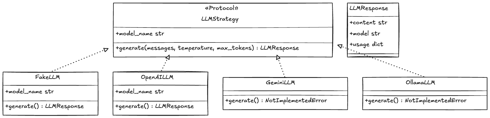

# Obsidian RAG Project

Obsidian vault를 RAG 시스템으로 변환하는 프로젝트입니다.

---

## 주요 기능

1. markdown 전처리

[document Link](docs/features/markdown_preprocessor.md)

2. 폴더 스캔

[document Link](docs/features/folder_scanner.md)

3. 

4. LLM Strategy 

Start Backend: Run uvicorn api.main:app --reload --app-dir src.
Start Frontend: Run npm run dev in front directory.

## 백엔드 실행
`PYTHONPATH=src uv run uvicorn api.main:app --reload`

## 프론트엔드 실행
`npm run dev`

