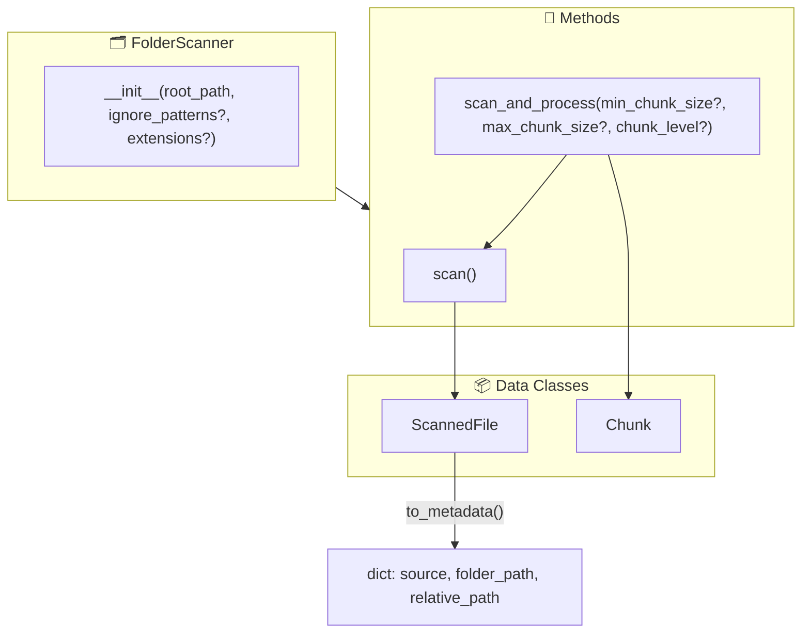

# Obsidian RAG Project

Obsidian vault를 RAG 시스템으로 변환하는 프로젝트입니다.

---

## 📁 Core Modules

### FolderScanner

> [📄 코드 보기](file:///Users/imseungmin/work/portfolio/obsidian_RAG/obrag/src/core/sync/folder_scanner.py)

지정된 폴더를 재귀적으로 탐색하여 마크다운 파일을 수집하고, 폴더 경로와 파일명을 메타데이터로 추출합니다.



---

#### 🔧 Constructor

```python
scanner = FolderScanner(
    root_path="/path/to/obsidian/vault",
    ignore_patterns={".obsidian", ".git"},  # Optional
    extensions=[".md"]                       # Optional, default: [".md"]
)
```

| Parameter | Type | Default | Description |
|-----------|------|---------|-------------|
| `root_path` | `str \| Path` | *required* | 스캔할 루트 폴더 경로 |
| `ignore_patterns` | `Set[str]` | `.obsidian`, `.git` 등 | 제외할 폴더명 패턴 |
| `extensions` | `List[str]` | `[".md"]` | 스캔할 파일 확장자 |

---

#### 📍 scan()

> [코드 위치: L99-136](file:///Users/imseungmin/work/portfolio/obsidian_RAG/obrag/src/core/sync/folder_scanner.py#L99-L136)

재귀적으로 폴더를 스캔하여 대상 파일 목록을 반환합니다.

<details>
<summary><b>Input/Output 예시</b></summary>

**폴더 구조:**
```
/vault
├── daily/
│   ├── 2024-01-01.md
│   └── 2024-01-02.md
├── projects/
│   └── rag-system.md
└── README.md
```

**Input:**
```python
scanner = FolderScanner("/vault")
files = scanner.scan()
```

**Output:** `List[ScannedFile]`
```python
[
    ScannedFile(
        full_path=Path("/vault/README.md"),
        relative_path=Path("README.md"),
        filename="README.md",
        folder_path=""
    ),
    ScannedFile(
        full_path=Path("/vault/daily/2024-01-01.md"),
        relative_path=Path("daily/2024-01-01.md"),
        filename="2024-01-01.md",
        folder_path="daily"
    ),
    # ...
]
```

</details>

---

#### 📍 scan_and_process()

> [코드 위치: L138-180](file:///Users/imseungmin/work/portfolio/obsidian_RAG/obrag/src/core/sync/folder_scanner.py#L138-L180)

스캔된 파일들을 읽어서 semantic chunking을 수행합니다.

| Parameter | Type | Default | Description |
|-----------|------|---------|-------------|
| `min_chunk_size` | `int` | `200` | 최소 청크 크기 (글자 수) |
| `max_chunk_size` | `int` | `1500` | 최대 청크 크기 (글자 수) |
| `chunk_level` | `int` | `2` | 청킹 기준 헤더 레벨 (##) |

<details>
<summary><b>Input/Output 예시</b></summary>

**Input:**
```python
scanner = FolderScanner("/vault")
chunks = scanner.scan_and_process(
    min_chunk_size=200,
    max_chunk_size=1500,
    chunk_level=2
)
```

**Output:** `List[Chunk]`
```python
[
    Chunk(
        text="## Introduction\n\nThis is the content...",
        metadata={
            "source": "README.md",
            "folder_path": "",
            "relative_path": "README.md",
            "headers": ["# Title", "## Introduction"]
        }
    ),
    Chunk(
        text="## Daily Log\n\n오늘 한 일...",
        metadata={
            "source": "2024-01-01.md",
            "folder_path": "daily",
            "relative_path": "daily/2024-01-01.md",
            "headers": ["# 2024-01-01", "## Daily Log"]
        }
    ),
    # ...
]
```

</details>

---

### 📄 ScannedFile

> [코드 위치: L36-50](file:///Users/imseungmin/work/portfolio/obsidian_RAG/obrag/src/core/sync/folder_scanner.py#L36-L50)

스캔된 파일의 정보를 담는 데이터 클래스입니다.

| Field | Type | Description |
|-------|------|-------------|
| `full_path` | `Path` | 절대 경로 |
| `relative_path` | `Path` | root 기준 상대 경로 |
| `filename` | `str` | 파일명 (확장자 포함) |
| `folder_path` | `str` | 상위 폴더 경로 (상대, `/` 구분자) |

**to_metadata() → dict**
```python
scanned_file.to_metadata()
# Returns:
# {
#     "source": "daily-log.md",
#     "folder_path": "daily/2024",
#     "relative_path": "daily/2024/daily-log.md"
# }
```

---

## 🚀 Quick Start

```python
from src.core.sync import FolderScanner

# 1. 스캐너 생성
scanner = FolderScanner("/path/to/obsidian/vault")

# 2. 파일만 스캔
files = scanner.scan()
print(f"Found {len(files)} markdown files")

# 3. 스캔 + 청킹까지 한번에
chunks = scanner.scan_and_process()
print(f"Generated {len(chunks)} chunks")
```

---

## 🔗 Related Modules

- **[MarkdownPreprocessor](file:///Users/imseungmin/work/portfolio/obsidian_RAG/obrag/src/core/preprocessing/markdown_preprocessor.py)** - 마크다운 파싱 및 청킹
- **[ChromaStore](file:///Users/imseungmin/work/portfolio/obsidian_RAG/obrag/src/core/vectorstore/chroma_store.py)** - 벡터 저장소
- **[RAGChain](file:///Users/imseungmin/work/portfolio/obsidian_RAG/obrag/src/core/rag/rag_chain.py)** - RAG 파이프라인