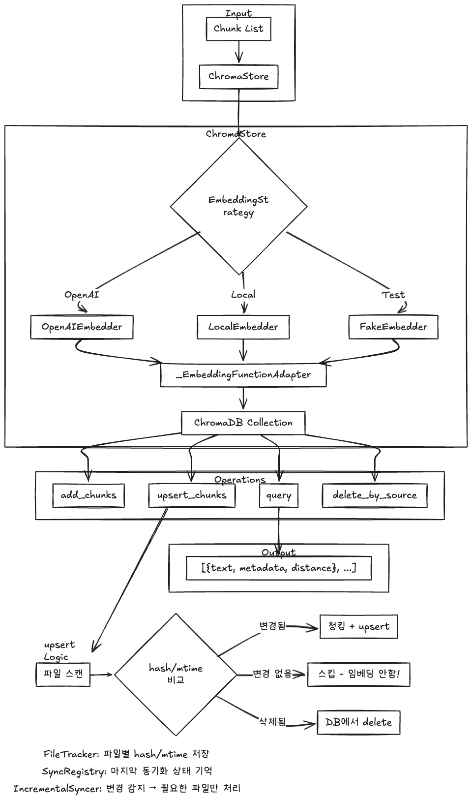

<div align="center">

# 🐙 Obsidian RAG

### 제2의 뇌를 진정한 지식 파트너로

Obsidian 노트를 AI가 학습하여 질문에 답하고,
PARA 방법론 기반 프로젝트 관리와 에빙하우스 복습 엔진을 제공하는 **통합 지식 관리 도구**

<br/>


</div>

<br/>

---

## 📌 프로젝트 소개

**Obsidian RAG**는 Obsidian Vault의 마크다운 노트를 벡터화하여 의미 기반 검색(Semantic Search)과 AI 채팅을 제공하는 풀스택 RAG 애플리케이션입니다.

단순한 키워드 검색이 아닌, **문서의 맥락과 의미를 이해**하여 질문에 답합니다.

### 핵심 가치

| | 기능 | 설명 |
|---|---|---|
| 💬 | **지능형 RAG 채팅** | Obsidian 노트 기반 의미 검색 + LLM 응답 생성 |
| 📊 | **PARA 프로젝트 대시보드** | 프로젝트 진척도 관리 및 유기(Stale) 프로젝트 탐지 |
| 🧠 | **에빙하우스 복습 엔진** | 망각곡선 기반 최적 복습 주기 알림 *(개발 예정)* |
| 🔄 | **증분 동기화** | 변경된 파일만 감지하여 효율적으로 Vector DB 업데이트 |

---

## 🏗️ 아키텍처

### RAG 파이프라인

```
┌─────────────┐     ┌──────────────┐     ┌──────────────┐     ┌─────────────┐
│  Obsidian   │     │  Markdown    │     │   Semantic   │     │  ChromaDB   │
│  Vault (.md)│────▶│  Preprocessor│────▶│   Chunking   │────▶│  (Vector DB)│
└─────────────┘     └──────────────┘     └──────────────┘     └──────┬──────┘
                                                                     │
┌─────────────┐     ┌──────────────┐     ┌──────────────┐           │
│   LLM       │     │   Prompt     │     │  Retriever   │◀──────────┘
│   Response  │◀────│   Builder    │◀────│  (Top-k)     │
└─────────────┘     └──────────────┘     └──────────────┘
```

### 시스템 구조

```
┌────────────────────────────────────────────────────────────┐
│                    Frontend (Next.js 16)                    │
│  ┌──────────┐ ┌──────────┐ ┌──────────┐ ┌──────────────┐  │
│  │ RAG Chat │ │  PARA    │ │Embedding │ │   Settings   │  │
│  │          │ │Dashboard │ │  Status  │ │              │  │
│  └────┬─────┘ └────┬─────┘ └────┬─────┘ └──────┬───────┘  │
│       └─────────────┴────────────┴──────────────┘          │
│                         REST API                           │
├────────────────────────────────────────────────────────────┤
│                    Backend (FastAPI)                        │
│  ┌──────────────────────────────────────────────────────┐  │
│  │                    API Layer                          │  │
│  │  /chat  /sync  /topics  /sessions  /projects  ...    │  │
│  └──────────────────────┬───────────────────────────────┘  │
│  ┌──────────────────────┴───────────────────────────────┐  │
│  │                   Core Layer                          │  │
│  │  ┌─────────┐ ┌───────────┐ ┌────────┐ ┌──────────┐  │  │
│  │  │RAGChain │ │ LLM       │ │Embedder│ │Sync      │  │  │
│  │  │         │ │ Strategy  │ │Strategy│ │Engine    │  │  │
│  │  └─────────┘ └───────────┘ └────────┘ └──────────┘  │  │
│  └──────────────────────┬───────────────────────────────┘  │
│  ┌──────────────────────┴───────────────────────────────┐  │
│  │                   Data Layer                          │  │
│  │         ChromaDB (Vectors)  +  SQLite (Metadata)      │  │
│  └──────────────────────────────────────────────────────┘  │
└────────────────────────────────────────────────────────────┘
```

---

## ✨ 주요 기능 상세

### 1. Markdown Preprocessor — 헤더 기반 Semantic Chunking

마크다운 문서를 RAG에 최적화된 청크로 분할합니다.


- **YAML Frontmatter 추출**: 태그, 생성일, 메타데이터 자동 파싱
- **코드 블록 보호**: 청킹 시 코드 블록이 분할되지 않도록 플레이스홀더 치환
- **계층적 헤더 추적**: Breadcrumb 경로로 문서 내 위치 컨텍스트 보존
- **적응형 청크 크기**: `min_size` / `max_size` 기반 자동 병합·분할

> 📄 [상세 문서](docs/features/markdown_preprocessor.md)

### 2. Folder Scanner — 재귀적 Vault 탐색


- `.obsidian`, `.git`, `node_modules` 등 시스템 폴더 자동 제외
- 파일별 폴더 경로, 상대 경로 메타데이터 자동 생성
- `scan_and_process()` 한 번의 호출로 스캔 + 청킹 완료

> 📄 [상세 문서](docs/features/folder_scanner.md)

### 3. ChromaDB Vector Store — 벡터 저장 및 유사도 검색



- Deterministic ID 기반 upsert로 **증분 동기화** 지원
- 메타데이터 필터링 (`where`) + 문서 내용 필터링 (`where_document`)
- EmbeddingStrategy 어댑터 패턴으로 임베더 교체 용이

> 📄 [상세 문서](docs/features/chroma_store.md)

### 4. LLM Strategy — 멀티 모델 지원


Protocol 패턴 기반으로 **LLM 교체가 자유로운** 아키텍처:

| Provider | 구현체 | 특징 |
|----------|--------|------|
| OpenAI | `OpenAILLM` | GPT-4o, GPT-4o-mini 등 |
| Google | `GeminiLLM` | Gemini Pro, Flash 등 |
| Ollama | `OllamaLLM` | 로컬 LLM (Llama, Mistral 등) |
| Test | `FakeLLM` | API 호출 없는 테스트용 |

```python
class LLMStrategy(Protocol):
    def generate(self, messages: List[Message], *, temperature: float = 0.7) -> LLMResponse: ...
    def stream_generate(self, messages: List[Message], ...) -> Iterator[str]: ...
```

### 5. Embedding Strategy — 다양한 임베딩 모델

| Provider | 구현체 | 특징 |
|----------|--------|------|
| OpenAI | `OpenAIEmbedder` | text-embedding-3-small |
| Sentence Transformers | `SentenceTransformerEmbedder` | 로컬 실행 |
| Multilingual E5 | `MultilingualE5Embedder` | 다국어 지원 |
| Ollama | `OllamaEmbedder` | 로컬 LLM 임베딩 |

### 6. Hybrid Search & Reranking

- **Hybrid Search**: 벡터 유사도 검색 + BM25 키워드 검색 결합
- **Reranker**: 검색 결과 재정렬로 정밀도 향상
- **Agentic RAG**: Query Rewriting, Self-Correcting Chain, Hierarchical Chunking

### 7. 대화 관리 (Session & Topic)

- **Topic(폴더)**: 대화를 주제별로 분류
- **Session(대화방)**: 개별 채팅 세션 관리
- **자동 저장**: 대화 내역 SQLite 자동 저장
- **대화 이동**: 세션을 다른 토픽으로 이동 가능

---

## 🎨 프론트엔드

**Neo-Brutalism** 디자인 컨셉의 모던 UI + 마스코트 캐릭터 시스템

### 페이지 구성

| 페이지 | 경로 | 설명 |
|--------|------|------|
| Chat | `/chat` | RAG 기반 AI 채팅 (스트리밍, 소스 표시) |
| PARA Dashboard | `/para` | 프로젝트 진척도 & Stale 탐지 대시보드 |
| Embedding | `/embedding` | 임베딩 상태 시각화 (Plotly.js) |
| Settings | `/settings` | LLM 모델, API 키, Vault 경로 설정 |

### 기술 스택

- **Framework**: Next.js 16 (App Router) + React 19
- **UI**: Tailwind CSS 4 + shadcn/ui (Radix UI)
- **Streaming**: AI SDK + SSE (Server-Sent Events)
- **Charts**: Recharts + Plotly.js
- **Animation**: Framer Motion

---

## 🛠️ 기술 스택 요약

### Backend

| 카테고리 | 기술 |
|----------|------|
| Language | Python 3.12+ |
| Framework | FastAPI (비동기, 자동 API 문서화) |
| Vector DB | ChromaDB (로컬 SQLite 기반) |
| Metadata DB | SQLite + SQLModel (ORM) |
| Embedding | OpenAI / Sentence Transformers / E5 / Ollama |
| LLM | OpenAI / Gemini / Ollama (Protocol 패턴) |
| Testing | Pytest (Phase별 구조화 테스트) |

### Frontend

| 카테고리 | 기술 |
|----------|------|
| Framework | Next.js 16 + React 19 |
| Styling | Tailwind CSS 4 + shadcn/ui |
| State | React Hooks + SSE Streaming |
| Visualization | Recharts + Plotly.js |
| Validation | Zod + React Hook Form |

---

## 📁 프로젝트 구조

```
obrag/
├── src/                          # Backend (Python)
│   ├── api/                      # FastAPI 라우터
│   │   ├── main.py               # App Factory, Lifespan
│   │   ├── deps.py               # 의존성 주입 (AppState)
│   │   └── routers/              # 엔드포인트 모듈
│   │       ├── chat.py           # /chat, /chat/stream
│   │       ├── sync.py           # /sync/trigger
│   │       ├── topic.py          # /topics CRUD
│   │       ├── session.py        # /sessions CRUD
│   │       ├── project.py        # /projects CRUD
│   │       ├── embedding.py      # 임베딩 관리
│   │       ├── settings.py       # 설정 API
│   │       └── health.py         # /health
│   ├── core/                     # 핵심 비즈니스 로직
│   │   ├── preprocessing/        # Markdown → Chunks
│   │   ├── llm/                  # LLM Strategy (OpenAI, Gemini, Ollama)
│   │   ├── embedding/            # Embedding Strategy (다중 모델)
│   │   ├── rag/                  # RAGChain, Retriever, PromptBuilder
│   │   │   └── agentic/          # Query Rewriting, Self-Correcting
│   │   ├── sync/                 # FolderScanner, IncrementalSyncer
│   │   ├── domain/               # SQLModel 엔티티 (Topic, Session, Message)
│   │   └── project/              # PARA 프로젝트 Scanner
│   ├── db/                       # 데이터베이스
│   │   ├── chroma_store.py       # ChromaDB 래퍼
│   │   └── engine.py             # SQLite 엔진
│   └── tasktests/                # 테스트 (Phase별)
│       ├── phase1/               # 전처리, 저장, 동기화
│       ├── phase2/               # API, RAG, LLM
│       ├── phase2_5/             # 세션/토픽 CRUD
│       └── phase3/               # 프로젝트 관리
│
├── front/                        # Frontend (Next.js)
│   ├── app/                      # App Router 페이지
│   │   ├── chat/page.tsx         # RAG 채팅 페이지
│   │   ├── para/page.tsx         # PARA 대시보드
│   │   ├── embedding/page.tsx    # 임베딩 시각화
│   │   └── settings/page.tsx     # 설정 페이지
│   ├── components/               # React 컴포넌트
│   │   ├── chat/                 # 채팅 UI 컴포넌트
│   │   ├── para/                 # 프로젝트 카드, 차트
│   │   ├── layout/               # AppShell, 사이드바
│   │   ├── embedding/            # 임베딩 시각화
│   │   └── ui/                   # shadcn/ui 공통 컴포넌트
│   └── lib/                      # 유틸리티
│       ├── api/                  # API 클라이언트
│       ├── types/                # TypeScript 타입
│       └── hooks/                # 커스텀 훅 (useChat, useSSE)
│
└── docs/                         # 문서
    ├── features/                 # 기능별 상세 문서
    ├── images/                   # 다이어그램, 스크린샷
    ├── spec/                     # 기술 스펙, 로드맵
    └── design/                   # 프론트엔드 디자인 플랜
```

---

## 🚀 시작하기

### 사전 요구사항

- Python 3.12+
- Node.js 18+
- [uv](https://github.com/astral-sh/uv) (Python 패키지 매니저, 권장)

### 1. 저장소 클론

```bash
git clone https://github.com/your-username/obrag.git
cd obrag
```

### 2. 환경 변수 설정

```bash
cp src/.env.example src/.env
```

```env
# LLM Provider (하나 이상 설정)
OPENAI_API_KEY=sk-...
GOOGLE_API_KEY=AI...

# Optional
EMBEDDING_API_KEY=        # 미설정 시 LLM 키 사용
```

### 3. 백엔드 실행

```bash
# 의존성 설치
uv sync

# 개발 서버 실행
PYTHONPATH=src uv run uvicorn api.main:app --reload
```

API 문서 확인: http://localhost:8000/docs

### 4. 프론트엔드 실행

```bash
cd front
npm install
npm run dev
```

http://localhost:3000 에서 확인

### 5. 테스트 실행

```bash
# 전체 테스트
pytest src/

# Phase별 테스트
pytest src/tasktests/phase1/ -v    # 전처리, 저장, 동기화
pytest src/tasktests/phase2/ -v    # API, RAG, LLM
pytest src/tasktests/phase2_5/ -v  # 세션/토픽 CRUD
pytest src/tasktests/phase3/ -v    # 프로젝트 관리
```

---

## 🗺️ 로드맵

| Phase | 상태 | 내용 |
|-------|------|------|
| **Phase 1** | ✅ 완료 | ETL 파이프라인 (Markdown 전처리, 폴더 스캔, ChromaDB 연동, 증분 동기화) |
| **Phase 2** | ✅ 완료 | RAG 채팅 (멀티 LLM, 임베딩, RAGChain, FastAPI 엔드포인트) |
| **Phase 2.5** | ✅ 완료 | 대화 저장소 (Topic/Session/Message CRUD, SQLite 연동) |
| **Phase 3** | 🔧 진행 중 | PARA 대시보드 (프로젝트 스캔, Stale 탐지, Frontend UI) |
| **Phase 4** | 📋 예정 | 에빙하우스 복습 엔진 (태그 기반 추적, 복습 주기 알림) |
| **Phase 5** | 📋 예정 | 통합 및 완성 (Docker, E2E 검증, Tauri 데스크톱 앱) |

---

## 🧩 설계 원칙

- **Strategy Pattern**: LLM과 Embedding 모두 Protocol 기반으로 구현체 교체 자유
- **Dependency Injection**: `AppState`를 통한 서비스 주입, 테스트 시 Mock 용이
- **Incremental Sync**: 전체 재처리 대신 변경분만 처리하여 효율성 확보
- **Phase-based Testing**: 기능 단위로 분리된 테스트 구조 (phase1 ~ phase3)
- **Granular Modules**: 블록/함수 단위의 작은 구현, 각 모듈 독립 테스트 가능

---

## 📄 라이선스

이 프로젝트는 개인 포트폴리오 프로젝트입니다.

