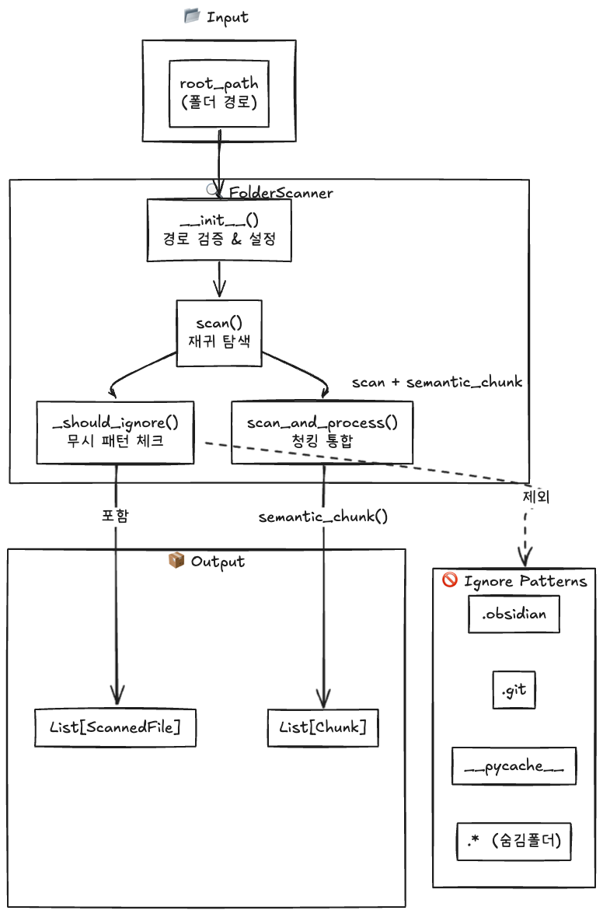

# FolderScanner

지정된 폴더를 재귀적으로 탐색하여 마크다운 파일을 수집하고, 폴더 경로와 파일명을 메타데이터로 추출하는 모듈입니다.

---

## 🔄 Processing Pipeline



[code link](../../src/core/sync/folder_scanner.py)

---

## 📦 Data Classes

### ScannedFile

스캔된 파일 정보를 담는 데이터 클래스입니다.

| Field           | Type   | Description                       |
| --------------- | ------ | --------------------------------- |
| `full_path`     | `Path` | 파일 절대 경로                    |
| `relative_path` | `Path` | root 기준 상대 경로               |
| `filename`      | `str`  | 파일명 (확장자 포함)              |
| `folder_path`   | `str`  | 상위 폴더 경로 (상대, `/` 구분자) |

#### to_metadata() 메서드

Chunk 메타데이터용 딕셔너리로 변환합니다.

```python
{
    "source": "example.md",
    "folder_path": "subfolder/nested",
    "relative_path": "subfolder/nested/example.md"
}
```

---

## 🔧 FolderScanner Class

### Constructor

| Parameter         | Type                  | Default                   | Description             |
| ----------------- | --------------------- | ------------------------- | ----------------------- |
| `root_path`       | `str \| Path`         | _required_                | 스캔할 루트 폴더 경로   |
| `ignore_patterns` | `Optional[Set[str]]`  | `DEFAULT_IGNORE_PATTERNS` | 제외할 폴더명 패턴      |
| `extensions`      | `Optional[List[str]]` | `[".md"]`                 | 스캔할 파일 확장자 목록 |

```python
from src.core.sync import FolderScanner

scanner = FolderScanner(
    root_path="/path/to/vault",
    ignore_patterns={".obsidian", ".git", "archive"},
    extensions=[".md", ".mdx"]
)
```

---

### 1️⃣ scan()

재귀적으로 폴더를 스캔하여 대상 파일 목록을 반환합니다.


<details>
<summary><b>Input/Output 예시</b></summary>

**폴더 구조:**

```
vault/
├── README.md
├── daily/
│   ├── 2024-01-01.md
│   └── 2024-01-02.md
├── projects/
│   └── rag/
│       └── notes.md
└── .obsidian/       ← 무시됨
    └── config.md
```

**Output:** `List[ScannedFile]`

```python
[
    ScannedFile(
        full_path=Path("/vault/README.md"),
        relative_path=Path("README.md"),
        filename="README.md",
        folder_path=""
    ),
    ScannedFile(
        full_path=Path("/vault/daily/2024-01-01.md"),
        relative_path=Path("daily/2024-01-01.md"),
        filename="2024-01-01.md",
        folder_path="daily"
    ),
    ScannedFile(
        full_path=Path("/vault/daily/2024-01-02.md"),
        relative_path=Path("daily/2024-01-02.md"),
        filename="2024-01-02.md",
        folder_path="daily"
    ),
    ScannedFile(
        full_path=Path("/vault/projects/rag/notes.md"),
        relative_path=Path("projects/rag/notes.md"),
        filename="notes.md",
        folder_path="projects/rag"
    ),
]
```

</details>

---

### 2️⃣ \_should_ignore()

경로가 무시 패턴에 해당하는지 확인합니다.

**무시 조건:**

1. `.`으로 시작하는 모든 폴더 (숨김 폴더)
2. `ignore_patterns`에 포함된 폴더명

<details>
<summary><b>Input/Output 예시</b></summary>

**기본 무시 패턴:**

```python
DEFAULT_IGNORE_PATTERNS = {
    ".obsidian", ".git", ".trash", ".github",
    "__pycache__", "node_modules", ".venv", "venv"
}
```

**테스트 결과:**

| Path                        | Result    |
| --------------------------- | --------- |
| `.obsidian/plugins/test.md` | ❌ 제외됨 |
| `.git/config.md`            | ❌ 제외됨 |
| `normal/folder/test.md`     | ✅ 포함됨 |
| `.hidden/secret.md`         | ❌ 제외됨 |

</details>

---

### 3️⃣ scan_and_process() ⭐ 핵심 함수

스캔된 파일들을 읽어서 청크로 변환합니다. 내부적으로 `semantic_chunk()`를 호출합니다.

| Parameter        | Type  | Default | Description                  |
| ---------------- | ----- | ------- | ---------------------------- |
| `min_chunk_size` | `int` | `200`   | 최소 청크 크기               |
| `max_chunk_size` | `int` | `1500`  | 최대 청크 크기               |
| `chunk_level`    | `int` | `2`     | 청킹 기준 헤더 레벨 (## = 2) |


<details>
<summary><b>Input/Output 예시</b></summary>

**Input:**

```python
chunks = scanner.scan_and_process(
    min_chunk_size=200,
    max_chunk_size=1500,
    chunk_level=2,
)
```

**Output:** `List[Chunk]`

```python
[
    Chunk(
        text="## Introduction\nThis is the introduction...",
        metadata={
            "source": "notes.md",
            "folder_path": "projects/rag",
            "relative_path": "projects/rag/notes.md",
            "header_path": "# RAG Notes > ## Introduction",
            "headers": ["Introduction"],
            "level": 2,
            "frontmatter": {"tags": ["rag", "ai"]}
        }
    ),
    # ... more chunks
]
```

</details>

---

## 🛠️ Convenience Functions

### scan_folder()

폴더를 스캔하여 마크다운 파일 목록을 반환하는 편의 함수입니다.

```python
from src.core.sync import scan_folder

files = scan_folder("/path/to/vault")
for f in files:
    print(f"{f.folder_path}/{f.filename}")
```

---

### scan_and_process_folder()

폴더를 스캔하고 모든 마크다운 파일을 청크로 변환하는 편의 함수입니다.

```python
from src.core.sync import scan_and_process_folder

chunks = scan_and_process_folder(
    "/path/to/vault",
    min_chunk_size=200,
    max_chunk_size=1500,
    chunk_level=2,
)

for chunk in chunks:
    print(f"📄 {chunk.metadata['source']}")
    print(f"📁 {chunk.metadata['folder_path']}")
```

---

## 🚀 Quick Start

```python
from src.core.sync import FolderScanner, scan_and_process_folder

# 방법 1: FolderScanner 클래스 사용
scanner = FolderScanner("/path/to/obsidian/vault")

# 파일 목록만 조회
files = scanner.scan()
print(f"발견된 파일: {len(files)}개")

# 파일 스캔 + 청킹
chunks = scanner.scan_and_process(chunk_level=2)
print(f"생성된 청크: {len(chunks)}개")

# 방법 2: 편의 함수 사용
chunks = scan_and_process_folder("/path/to/vault")

# 결과 확인
for chunk in chunks:
    print(f"📄 Source: {chunk.metadata['source']}")
    print(f"📁 Folder: {chunk.metadata['folder_path']}")
    print(f"📝 Text: {chunk.text[:100]}...")
```

---

## 🔗 Related Modules

- **[MarkdownPreprocessor](./markdown_preprocessor.md)** - semantic_chunk() 함수로 청킹 수행
- **[debug_folder_scanner.py](../../src/tasktests/phase1/debug_folder_scanner.py)** - 디버깅용 스크립트
