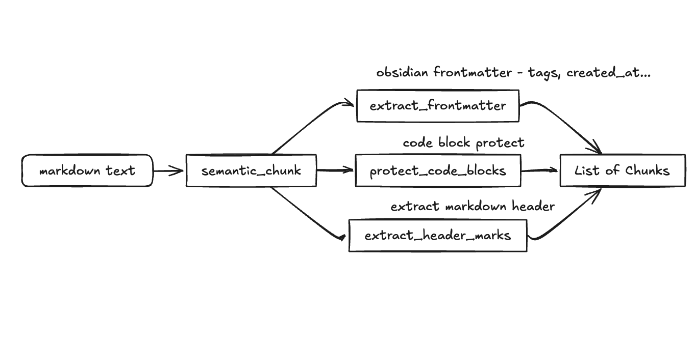
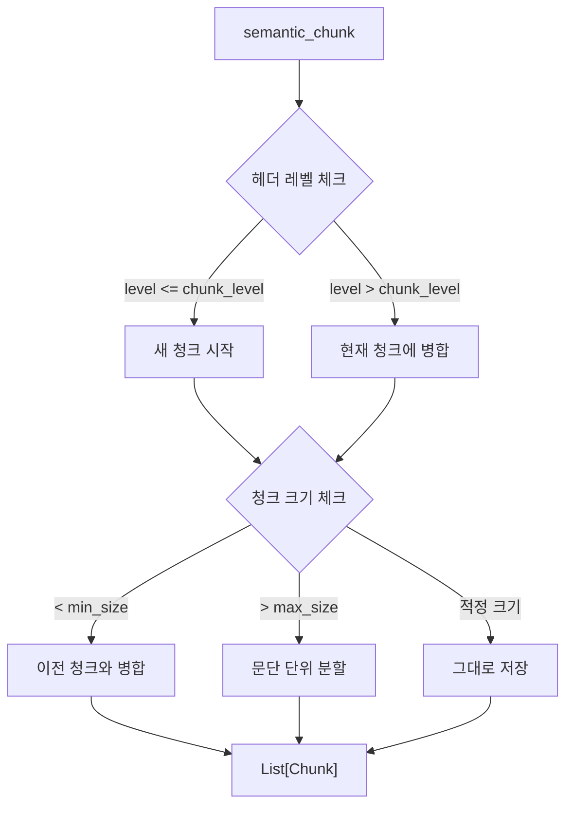

# MarkdownPreprocessor

마크다운 텍스트를 RAG 시스템용으로 전처리하는 모듈입니다.

---

## 🔄 Processing Pipeline


[code](../../src/core/preprocessing/markdown_preprocessor.py)

---

## 📦 Data Classes

### YAMLFrontmatter

| Field         | Type            | Description      |
| ------------- | --------------- | ---------------- |
| `raw`         | `str`           | 원본 YAML 문자열 |
| `tags`        | `List[str]`     | 태그 목록        |
| `create_date` | `Optional[str]` | 생성일           |
| `extra`       | `dict`          | 기타 메타데이터  |

### HeaderMark

| Field          | Type        | Description                      |
| -------------- | ----------- | -------------------------------- |
| `position`     | `int`       | 문서 내 시작 위치                |
| `end_position` | `int`       | 헤더 라인 끝 위치                |
| `level`        | `int`       | 헤더 레벨 (1-6)                  |
| `title`        | `str`       | 헤더 제목                        |
| `path`         | `List[str]` | 상위 헤더 포함 경로 (breadcrumb) |

### Chunk

| Field      | Type   | Description                                  |
| ---------- | ------ | -------------------------------------------- |
| `text`     | `str`  | 청크 텍스트                                  |
| `metadata` | `dict` | 메타데이터 (source, headers, frontmatter 등) |

---

## 🔧 Functions

### 1️⃣ extract_frontmatter()

YAML frontmatter를 추출하고 본문에서 제거합니다.

<details>
<summary><b>Input/Output 예시</b></summary>

**Input:**

```markdown
---
tags:
  - AI
  - NLP
create: 2024-01-01
---

# Title

Content here...
```

**Output:** `Tuple[YAMLFrontmatter, str]`

```python
(
    YAMLFrontmatter(
        raw="tags:\n  - AI\n  - NLP\ncreate: 2024-01-01",
        tags=["AI", "NLP"],
        create_date="2024-01-01",
        extra={}
    ),
    "# Title\nContent here..."
)
```

</details>

---

### 2️⃣ protect_code_blocks()

코드 블록을 플레이스홀더로 치환하여 청킹 시 분할되지 않도록 보호합니다.

<details>
<summary><b>Input/Output 예시</b></summary>

**Input:**

````markdown
Some text

```python
def hello():
    print("world")
```
````

More text

````

**Output:** `Tuple[str, List[Tuple[str, str]]]`
```python
(
    "Some text\n\n__CODE_BLOCK_0__\n\nMore text",
    [
        ("__CODE_BLOCK_0__", "```python\ndef hello():\n    print(\"world\")\n```")
    ]
)
````

</details>

---

### 3️⃣ extract_header_marks()

문서에서 모든 헤더를 추출하고 계층 구조(breadcrumb)를 추적합니다.

<details>
<summary><b>Input/Output 예시</b></summary>

**Input:**

```markdown
# Transformer

## Architecture

### Encoder

### Decoder

## Training
```

**Output:** `List[HeaderMark]`

```python
[
    HeaderMark(position=0,  level=1, title="Transformer", path=["Transformer"]),
    HeaderMark(position=14, level=2, title="Architecture", path=["Transformer", "Architecture"]),
    HeaderMark(position=29, level=3, title="Encoder", path=["Transformer", "Architecture", "Encoder"]),
    HeaderMark(position=40, level=3, title="Decoder", path=["Transformer", "Architecture", "Decoder"]),
    HeaderMark(position=51, level=2, title="Training", path=["Transformer", "Training"]),
]
```

</details>

---

### 4️⃣ semantic_chunk() ⭐ 핵심 함수

마크다운을 헤더 기반으로 Semantic Chunking합니다.



| Parameter        | Type   | Default    | Description                         |
| ---------------- | ------ | ---------- | ----------------------------------- |
| `text`           | `str`  | _required_ | 마크다운 텍스트                     |
| `source`         | `str`  | _required_ | 원본 파일명                         |
| `extra_metadata` | `dict` | `None`     | 추가 메타데이터                     |
| `min_size`       | `int`  | `200`      | 최소 청크 크기 (이보다 짧으면 병합) |
| `max_size`       | `int`  | `1500`     | 최대 청크 크기 (이보다 길면 분할)   |
| `chunk_level`    | `int`  | `2`        | 청킹 기준 헤더 레벨 (## = 2)        |

<details>
<summary><b>Input/Output 예시</b></summary>

**Input:**

```python
text = """
---
tags:
  - AI
---
# Transformer

## Architecture
The transformer architecture...

### Encoder
Encoder details...

## Training
Training process...
"""

chunks = semantic_chunk(
    text=text,
    source="transformer.md",
    min_size=200,
    max_size=1500,
    chunk_level=2
)
```

**Output:** `List[Chunk]`

```python
[
    Chunk(
        text="## Architecture\nThe transformer architecture...\n\n### Encoder\nEncoder details...",
        metadata={
            "source": "transformer.md",
            "header_path": "# Transformer > ## Architecture",
            "headers": ["Architecture", "Encoder"],
            "level": 2,
            "frontmatter": {"tags": ["AI"], "create_date": None}
        }
    ),
    Chunk(
        text="## Training\nTraining process...",
        metadata={
            "source": "transformer.md",
            "header_path": "# Transformer > ## Training",
            "headers": ["Training"],
            "level": 2,
            "frontmatter": {"tags": ["AI"], "create_date": None}
        }
    )
]
```

</details>

---

### 5️⃣ process_markdown_file()

파일 경로를 받아 청크 리스트를 반환하는 편의 함수입니다.

```python
from src.core.preprocessing import process_markdown_file

chunks = process_markdown_file("/path/to/document.md")
```

---

## 🚀 Quick Start

```python
from src.core.preprocessing import semantic_chunk, process_markdown_file

# 방법 1: 텍스트 직접 처리
text = open("document.md").read()
chunks = semantic_chunk(
    text=text,
    source="document.md",
    chunk_level=2  # ## 단위로 청킹
)

# 방법 2: 파일 경로로 처리
chunks = process_markdown_file("document.md")

# 결과 확인
for chunk in chunks:
    print(f"Headers: {chunk.metadata['headers']}")
    print(f"Text: {chunk.text[:100]}...")
```

---

## 🔗 Related Modules

- **[FolderScanner](../../src/core/sync/folder_scanner.py)** - 폴더 스캔 후 이 모듈로 청킹
- **[debug_preprocessor.py](../../src/tasktests/phase1/debug_preprocessor.py)** - 디버깅용 스크립트
