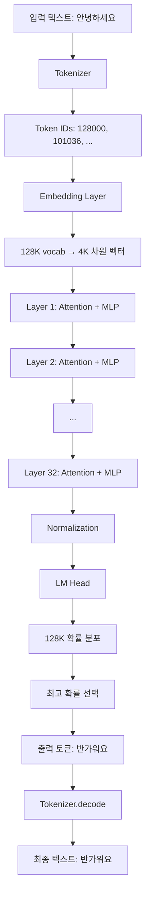

---
tags:
  - transformer
  - llm-engineering
  - pipeline
  - week3
  - day4
  - 양자화
create: 2025-11-16 12:43:42
---
**Week3 Day4: Transformer Models** 

```ad-info
학습 목표: HuggingFace Transformers 라이브러리의 **저수준 API** 학습
```
- **Pipeline API**: `pipeline("text-generation")` - 추상화된 고수준 인터페이스
- **Model API**: `AutoModelForCausalLM.from_pretrained()` - PyTorch 기반 저수준 제어

> [!focus]
> 1. 모델 내부 동작 이해: Transformer가 어떻게 작동하는지
> 2. 고급 제어: 양자와(Quantization), 토크나이징, 생성 파라미터 조정
> 3. 메모리 최적화: 제한된 GPU 리소스에서 대형 모델 실행
> 4. 실전 준비: 실제 프로젝트에서 모델 커스터마이징 능력

```table-of-contents
```

**모델 메모리 줄일때 참고하기**


# Section1: 환경 설정
```python
!pip install -q --upgrade bitsandbytes accelerate
```
- `bitsandbytes`: 양자화(Quantization) 라이브러리
	- 모델을 4bit로 압축하여 메모리 절약
	- 8B모델을 2GB 정도로 축소 가능
		- **Float32 (32-bit)**: 높은 정밀도, 큰 메모리
		- **BFloat16 (16-bit)**: 중간 정밀도, 절반 메모리
		- **4-bit Quantization**: 낮은 정밀도, 최소 메모리
		- **nf4 (NormalFloat4)**: 정규분포 최적화 4-bit 형식
		- **Double Quantization**: 양자화 파라미터도 양자화 (추가 압축)
- `accelerate`: 모델을 여러 GPU/CPU에 효율적으로 분산
	- `device_map=auto` 제공

```text
device_map="auto" → 자동으로 최적 배치
GPU에 최대한 올리고
넘치는 부분은 CPU RAM으로
디스크까지 활용 (극단적 경우)
```

## 필요 라이브러리
- `from huggingface_hub import login`: HuggingFace Hub 로그인
- `from transformers import AutoTokenizer, AutoModelForCausalLm, TextStreamer, BitsAndBytesConfig`
	- `AutoTokenizer`: 텍스트 -> 토큰 ID 변환
	- `AutoModelForCausalLM`: 언어 모델 자동 로드
		- 모델 아키텍처를 자동 감지하여, 하나의 클래스로 다른 언어모델 클래스 사용할 필요 없이 사용 가능
	- `TextStreamer`: 생성된 텍스트 실시간 출력(부드럽게)
	- `BitsAndBytesConfig`: 양자화 설정 구성
- `import torch`: 딥러닝 프레임워크
- `import gc`: 가비지콜렉션, 메모리 관리용

# Section2: HuggingFace 인증 및 모델 엑세스
## HuggingFace Hub
- **HuggingFace Hub**: 오픈소스 모델 저장소 (GitHub의 모델 버전)
- **API 토큰**: 개인 인증 키 (GitHub Personal Access Token과 유사)
- **게이트드 모델 (Gated Models)**: Llama처럼 약관 동의 후 사용 가능한 모델


```python
hf_token = userdata.get('HF_TOKEN')

login(hf_token, add_to_git_credential=True)
```
- hugging face 로그인

# Section3: Quantization 이해

## 모델 선택
```python
# see here: https://huggingface.co/meta-llama/Meta-Llama-3.1-8B-Instruct
LLAMA = "meta-llama/Meta-Llama-3.1-8B-Instruct"
# see here: https://huggingface.co/meta-llama/Llama-3.2-1B-Instruct
# LLAMA = "meta-llama/Llama-3.2-1B-Instruct"
PHI = "microsoft/Phi-4-mini-instruct"
GEMMA = "google/gemma-3-270m-it"
QWEN = "Qwen/Qwen3-4B-Instruct-2507"
DEEPSEEK = "deepseek-ai/DeepSeek-R1-Distill-Qwen-1.5B"
messages = [
{"role": "user", "content": "Tell a joke for a room of Data Scientists"}
]
```

```python
# Quantization Config - 적은 메모리를 사용해서 모델을 메모리에 load하게 해줌
  quant_config = BitsAndBytesConfig(
      load_in_4bit=True,                      # 4-bit 양자화 활성화
      bnb_4bit_use_double_quant=True,         # 이중 양자화
      bnb_4bit_compute_dtype=torch.bfloat16,  # 계산 타입
      bnb_4bit_quant_type="nf4"               # NormalFloat4
  )
```
````ad-note
Quantization 파라미터 의미
  load_in_4bit=True
  - 의미: 32-bit → 4-bit (메모리 1/8로 축소)
  - 효과: 8B 모델이 32GB → 4GB로!
```Text
메모리(GB) = 파라미터 수 × 비트 수 ÷ 8 ÷ 1,000,000,000

예시: Llama 1B (1,000,000,000 파라미터)
- FP32: 1B × 32 ÷ 8 ÷ 1e9 = 4GB
- FP16: 1B × 16 ÷ 8 ÷ 1e9 = 2GB
- 4-bit: 1B × 4 ÷ 8 ÷ 1e9 = 0.5GB
```


  bnb_4bit_use_double_quant=True
  - 의미: 양자화 파라미터도 양자화 (메타 압축)
  - 효과: 추가로 ~0.4GB 절약

  bnb_4bit_compute_dtype=torch.bfloat16
  - 의미: 저장은 4-bit, 계산은 bfloat16
  - 효과: 속도 ↑, 정확도 균형

  bnb_4bit_quant_type="nf4"
  - 의미: NormalFloat4 (정규분포 최적화)
  - 대안: "fp4" (uniform distribution)
````

**Trade-off 그래프**:

```
정확도 ↑
│
│ FP32 ●───────────────  (느림, 정확)
│        ╲
│         ╲ FP16 ●──────  (빠름, 약간 부정확)
│              ╲
│               ╲ bfloat16 ●  (빠름, 균형)
│                    ╲
│                     ╲ 4-bit ●  (매우 빠름, 부정확)
└─────────────────────────────→ 속도 ↑
```

**bfloat16의 특징**:

```python
torch.float32  # 32-bit: 메모리 ↑↑, 정확도 ↑↑, 속도 ↓↓
torch.float16  # 16-bit: 메모리 ↓, 정확도 ↓, 속도 ↑
torch.bfloat16 # 16-bit: 메모리 ↓, 정확도 ○, 속도 ↑

# bfloat16 vs float16 차이:
# - 둘 다 16-bit
# - bfloat16: 지수부 넓음 → 큰 숫자 표현 좋음 → LLM에 유리
# - float16: 정밀도 높음 → 작은 숫자 정확 → 이미지 처리에 유리
```

# Section4: Tokenizer
`````ad-info
## Tokenizer?
```ad-missing
LLM은 텍스트를 이해 못함 -> 오직 숫자만 처리
```

```ad-success
Tokenizer = 텍스트 $\iff$ 숫자 변환기
```

```text
# 사람이 보는 것
text = "Hello, world!"

# LLM이 보는 것
tokens = [9906, 11, 1917, 0]  # 숫자 배열

# Tokenizer의 역할
tokenizer.encode("Hello, world!")  → [9906, 11, 1917, 0]
tokenizer.decode([9906, 11, 1917, 0]) → "Hello, world!"
```


`````

```python
# Tokenizer 로드
tokenizer = AutoTokenizer.from_pretrained(LLAMA)
tokenizer.pad_token = tokenizer.eos_token
inputs = tokenizer.apply_chat_template(messages, return_tensors="pt").to("cuda")

print("✅ Tokenizer 로드 완료")
print(f"모델: {LLAMA}")
print(f"Vocab 크기: {len(tokenizer)}") # Llama Tokenizer의 어휘의 크기

# 테스트 문장
text = "안녕하세요! LLM을 학습 중입니다."

# 인코딩 (텍스트 → 숫자)
tokens = tokenizer.encode(text)
print(f"원본 텍스트: {text}")
print(f"토큰 IDs: {tokens}")
print(f"토큰 개수: {len(tokens)}")

# 디코딩 (숫자 → 텍스트)
decoded = tokenizer.decode(tokens)
print(f"복원된 텍스트: {decoded}")

# 개별 토큰 확인
print("\n개별 토큰:")
for i, token_id in enumerate(tokens):
    token_text = tokenizer.decode([token_id])
    print(f"  {i}: {token_id} → '{token_text}'")
```

`tokenizer.pad_token = tokenizer.eos_token` **pad 토큰을 eos(endOfSentense) 토큰과 동일시 하는게 관례** 
```text
# 문제: Llama는 기본적으로 pad_token이 없음
tokenizer.pad_token  # None

# 해결: EOS 토큰을 패딩으로 재사용
tokenizer.pad_token = tokenizer.eos_token  # <|end_of_text|>

# 왜 필요한가?
# 배치 처리 시 길이를 맞춰야 함
문장1: [1, 2, 3]           # 3 토큰
문장2: [4, 5, 6, 7, 8]     # 5 토큰

# 패딩 후:
문장1: [1, 2, 3, PAD, PAD] # 5 토큰
문장2: [4, 5, 6, 7, 8]     # 5 토큰

```

`inputs = tokenizer.apply_chat_template(messages, return_tensors="pt").to("cuda")`
```text
# 1. 채팅 형식으로 변환
messages = [
    {"role": "system", "content": "You are helpful"},
    {"role": "user", "content": "Tell me a joke"}
]

# 2. apply_chat_template이 자동으로:
text = """<|begin_of_text|><|start_header_id|>system<|end_header_id|>
You are helpful<|eot_id|>
<|start_header_id|>user<|end_header_id|>
Tell me a joke<|eot_id|>"""

# 3. 토크나이징
inputs = tokenizer.encode(text)

# 4. PyTorch 텐서로 변환
return_tensors="pt"  → torch.Tensor

# 5. GPU로 이동
.to("cuda")
```

# Section 5: Model 구조 탐색

```python
model = AutoModelForCausalLM.from_pretrained(
    LLAMA, 
    device_map="auto", 
    quantization_config=quant_config
)

memory = model.get_memory_footprint() / 1e6
# Memory footprint: 5,591.5 MB
```
```text
# 모델이 GPU 메모리에서 차지하는 크기

# Llama 1B 모델:
# - 원본 (FP32): ~4GB
# - 4-bit 양자화: ~1GB
# - 실제 측정: 5,591 MB ≈ 5.6GB

# 왜 1GB보다 큰가?
# - 모델 가중치: ~1GB
# - Quantization 메타데이터: ~200MB
# - GPU 버퍼/캐시: ~4GB (동적 할당)
# - Special tokens embedding: ~100MB
```

`model`
```text
LlamaForCausalLM(
  (model): LlamaModel(
    (embed_tokens): Embedding(128256, 4096)
    (layers): ModuleList(
      (0-31): 32 x LlamaDecoderLayer(
        (self_attn): LlamaAttention(
          (q_proj): Linear4bit(in_features=4096, out_features=4096, bias=False)
          (k_proj): Linear4bit(in_features=4096, out_features=1024, bias=False)
          (v_proj): Linear4bit(in_features=4096, out_features=1024, bias=False)
          (o_proj): Linear4bit(in_features=4096, out_features=4096, bias=False)
        )
        (mlp): LlamaMLP(
          (gate_proj): Linear4bit(in_features=4096, out_features=14336, bias=False)
          (up_proj): Linear4bit(in_features=4096, out_features=14336, bias=False)
          (down_proj): Linear4bit(in_features=14336, out_features=4096, bias=False)
          (act_fn): SiLUActivation()
        )
        (input_layernorm): LlamaRMSNorm((4096,), eps=1e-05)
        (post_attention_layernorm): LlamaRMSNorm((4096,), eps=1e-05)
      )
    )
    (norm): LlamaRMSNorm((4096,), eps=1e-05)
    (rotary_emb): LlamaRotaryEmbedding()
  )
  (lm_head): Linear(in_features=4096, out_features=128256, bias=False)
)
```

1. **Embedding**: 단어 → 벡터 (128K 단어 → 4K 차원)
2. **32 Layers**: 반복 학습 (더 많으면 더 똑똑)
3. **Attention**: 문맥 이해 ("은행" → 강가? 금융?)
4. **MLP**: 패턴 변환
5. **lm_head**: 다음 단어 예측 (4K → 128K 확률)
6. **4-bit**: 메모리 8배 절약


# Section 6: Text Generation
```python
outputs = model.generate(inputs, max_new_tokens=80)

outputs[0]
```
```python
The attention mask and the pad token id were not set. As a consequence, you may observe unexpected behavior. Please pass your input's `attention_mask` to obtain reliable results.
Setting `pad_token_id` to `eos_token_id`:128001 for open-end generation.
The attention mask is not set and cannot be inferred from input because pad token is same as eos token. As a consequence, you may observe unexpected behavior. Please pass your input's `attention_mask` to obtain reliable results.
```
### A. 경고 메시지의 핵심 (Attention Mask)
- **Attention Mask (어텐션 마스크):** LLM은 여러 문장(배치)을 한 번에 처리할 때, 문장의 길이가 제각각이므로 가장 긴 문장에 맞춰 **패딩(Padding)**이라는 특수 토큰을 뒤에 채워 넣습니다.
    - **마스크의 역할:** 어텐션 마스크는 모델에게 "이 부분은 진짜 데이터가 아니고 **패딩**이니까 어텐션(집중)을 할 필요가 없다"고 알려주는 역할을 합니다.
    - **경고의 의미:** 코드가 이 마스크를 명시적으로 설정하지 않아서, 모델이 패딩 토큰을 잘못 처리하고 원치 않는 결과를 생성할 수 있다는 경고입니다.
### B. 경고 메시지의 핵심 (Pad Token ID)
- **Pad Token ID:** 패딩 토큰에 할당된 고유 ID입니다.
- **Setting pad_token_id to eos_token_id:128001...:** 코드가 pad_token_id를 설정하지 않자, 시스템이 자동으로 **문장의 끝(End of Sentence, eos_token_id)** 토큰 ID로 설정해 버렸다는 의미입니다.
    - **문제점:** 패딩 토큰과 문장 종료 토큰이 같아지면, 모델은 문장의 끝으로 인코딩된 패딩 토큰을 만났을 때 생성을 **멈춰야 할지** 아니면 **무시하고 계속해야 할지** 혼란을 겪을 수 있습니다. 이것이 두 번째 경고의 내용입니다.


```python
tokenizer.decode(outputs[0])
```
```python
<|begin_of_text|><|start_header_id|>system<|end_header_id|>\n\nCutting Knowledge Date: December 2023\nToday Date: 26 Jul 2024\n\n<|eot_id|><|start_header_id|>user<|end_header_id|>\n\nTell a joke for a room of Data Scientists<|eot_id|><|start_header_id|>assistant<|end_header_id|>\n\nWhy did the regression model break up with the neural network?\n\nBecause it was a bad fit and the neural network was overfitting to the relationship.<|eot_id|>
```
#### 1. System Prompt (시스템 프롬프트)
```
<|start_header_id|>system<|end_header_id|>\n\nCutting Knowledge Date: December 2023\nToday Date: 26 Jul 2024\n\n<|eot_id|>
```
*   **역할:** 모델에게 현재 상황에 대한 **컨텍스트(배경 정보)**를 제공합니다.
*   `Cutting Knowledge Date: December 2023`: 이 모델이 2023년 12월까지의 데이터로 학습되었다는 **지식의 마감일**을 알려줍니다.
*   `Today Date: 26 Jul 2024`: 현재 시뮬레이션 날짜를 설정합니다.
#### 2. User Prompt (사용자 입력)

```
<|start_header_id|>user<|end_header_id|>\n\nTell a joke for a room of Data Scientists<|eot_id|>
```
*   **역할:** 사용자(User)가 모델에게 실제로 요청한 명령어입니다.
*   **요청:** "데이터 과학자들을 위한 농담을 해줘."
#### 3. Assistant Response (모델 응답)

```
<|start_header_id|>assistant<|end_header_id|>\n\nWhy did the regression model break up with the neural network?\n\nBecause it was a bad fit and the neural network was overfitting to the relationship.<|eot_id|>
```
*   **역할:** 모델(Assistant)이 사용자 요청에 대해 **생성한 응답**입니다.
*   **내용 (데이터 과학 농담):**
    *   **질문:** 왜 회귀 모델(regression model)이 신경망(neural network)과 헤어졌을까요?
    *   **답변:** 회귀 모델은 **적합도가 안 좋았고(bad fit)**, 신경망은 관계에 **과적합(overfitting)**했기 때문입니다.
    *   *(참고: `bad fit`과 `overfitting`은 데이터 과학에서 모델의 성능을 평가하는 중요한 용어입니다.)*

# Section7: 여러 모델 실행
- 메모리 정리
```python
# Clean up memory
del model, inputs, tokenizer, outputs
gc.collect()
torch.cuda.empty_cache()
```
**실행하고 결과 확인**:
```python
# GPU 메모리 확인
import torch
print(f"GPU 할당: {torch.cuda.memory_allocated() / 1e9:.2f} GB")
print(f"GPU 예약: {torch.cuda.memory_reserved() / 1e9:.2f} GB")
```

### Generate 함수
```python
def generate(model, messages, quant=True, max_new_tokens=80):
  tokenizer = AutoTokenizer.from_pretrained(model)
  tokenizer.pad_token = tokenizer.eos_token
  input_ids = tokenizer.apply_chat_template(messages, return_tensors="pt", add_generation_prompt=True).to("cuda")
  attention_mask = torch.ones_like(input_ids, dtype=torch.long, device="cuda")
  streamer = TextStreamer(tokenizer)
  
  if quant:
    model = AutoModelForCausalLM.from_pretrained(model, quantization_config=quant_config).to("cuda")
  else:
    model = AutoModelForCausalLM.from_pretrained(model).to("cuda")
    
  outputs = model.generate(input_ids=input_ids, attention_mask=attention_mask, max_new_tokens=max_new_tokens, streamer=streamer)
```

### 여러 모델 실행
```python
messages = [
    {"role": "user", "content": "Tell a joke for a room of Data Scientists"}
]

# 1. Phi-4 (Microsoft)
generate(PHI, messages)

# 2. Gemma 3 (Google) - 양자화 없음
generate(GEMMA, messages, quant=False)

# 3. Qwen 3 (Alibaba)
generate(QWEN, messages)

# 4. DeepSeek R1 (추론 모델) - 더 긴 답변
generate(DEEPSEEK, messages, quant=False, max_new_tokens=500)
```




## 📚 공식 문서
- [HuggingFace Transformers](https://huggingface.co/docs/transformers)
- [BitsAndBytes 문서](https://github.com/TimDettmers/bitsandbytes)
- [PyTorch 공식 문서](https://pytorch.org/docs)

## 🎓 심화 학습
- [Attention Is All You Need (논문)](https://arxiv.org/abs/1706.03762)
- [Llama 아키텍처 상세](https://github.com/huggingface/transformers/blob/main/src/transformers/models/llama/modeling_llama.py)
- [Quantization 심화](https://arxiv.org/abs/2208.07339)

## 🛠️ 실전 예제
- [HuggingFace Model Hub](https://huggingface.co/models)
- [Llama 사용 예제 Colab](https://colab.research.google.com/drive/1deJO03YZTXUwcq2vzxWbiBhrRuI29Vo8)

## 💬 커뮤니티
- [HuggingFace Forums](https://discuss.huggingface.co/)
- [Reddit r/LocalLLaMA](https://www.reddit.com/r/LocalLLaMA/)

